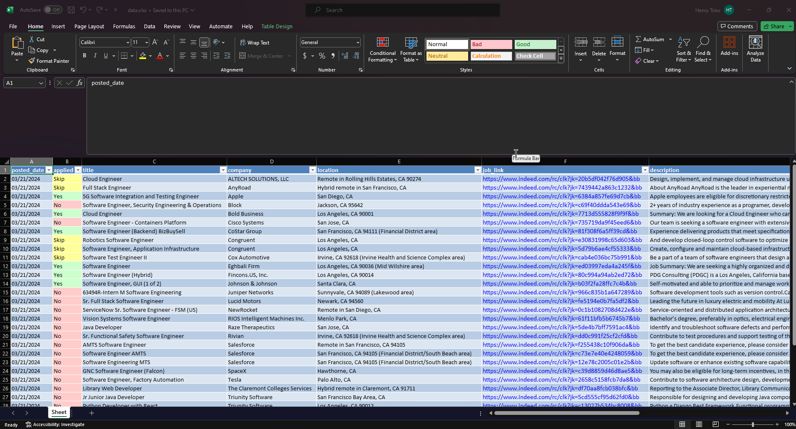

# Job Listing Scraper

This application scrapes Indeed job results and parses the data into a working Excel spreadsheet that users can use for their job search.

## Features

- User-friendly GUI implemented via customTkinter
- Searching jobs using Position, Location, Date Posted, Job Type, and Experience Level fields
- Filtering job results via minimum years of experience mentioned in job description snippets
- Filtering job results via keywords in job titles
- Scraping all pages returned
- Scraping a specific number of pages
- Custom minimum crawl delay
- Duplicate result handling
- Job tracking

## Usage

### Installation

Follow these steps to install the project:

1. **Clone the repository:**

```bash
git clone https://github.com/Trieuh2/job-listing-scraper.git
cd job-listing-scraper
```

2. Install dependencies using pip

```bash
pip install -r requirements.txt
```

### Running the Scraper
3. Run the application

```bash
python src/main.py
```


## Configuration
This web scraper is designed to be user-friendly and highly customizable. Below are the steps to tailor the scraping to your needs:


### Indeed Search Settings

- **Position**: Enter the job title you're interested in. For example, 'Software Engineer'.
- **Location**: Specify the location where you want to search for jobs, such as 'California' or 'San Francisco, CA'.
- **Max Years of Experience**: Input the maximum years of experience relevant to the job positngs you're seeking. Scraper will ignore jobs mentioning years of experience above your specified amount. 
- **Date Posted**: Select the time frame of job postings from the dropdown menu.
- **Job Type**: Choose the job type from the available options or leave empty. (Examples: Full-Time/Part-Time/Contract)
- **Experience Level**: Select the desired experience level for the job postings. This will limit results tagged specifically by Indeed.

### Excluded keywords
- Add keywords in the filter list to exclude results based on job title.
- The scraper will ignore jobs containing any of the excluded keywords in the job title.
- Note that changes to the excluded keywords will not affect already scraped data.

### Excel Settings
- **Output path**: Click 'Browse' to select the path where the Excel file with the scraped data will be saved.
- **Update Spreadsheet on Completion**: Check this option if you want the spreadsheet to be updated when the scraping session completes.

### Advanced Settings
- **Scrape all pages?**: Check this box if you want to scrape all pages of search results; otherwise, specify the number of pages in the adjacent field.
- **Crawl Delay**: Set the minimum delay between requests to avoid potential rate-limiting.


## Example Data Output



The example data output in the screenshot above represents the parsed and filtered data from the job search results. A table is automatically created with conditional formatting applied to the '**applied**' column, to help users keep track of jobs they have already applied to. The '**job_link**' column contains the redirect link from Indeed to the direct job posting page. 

A '**hashId**' is generated for every job result by encoding the '**job_link**' URL with SHA-256. The purpose of this column is used to handle duplicate results and allow spreadsheet modification. Since the scraper may re-encounter previous results in new scrapes, the application will retain the '**posted_date**' and '**applied**' values that were previously set in the spreadsheet.

A useful way of utilizing this spreadsheet would be filtering the results by a specific job title or filtering the results based on the short snippet of description information logged underneath the '**description**' column.


## Disclaimer

This project is intended for educational purposes only. The software is provided "as is" without warranty of any kind, express or implied. The developers of this project do not endorse or encourage any activities that may violate the robots.txt file, Terms of Service, or any other usage policies of websites being scraped.

Users of this software are responsible for ensuring that their use of the software complies with all applicable laws and website policies. The developers of this project will not be liable for any damages or legal consequences resulting from the use of this software.

Please use this software responsibly and ethically.
