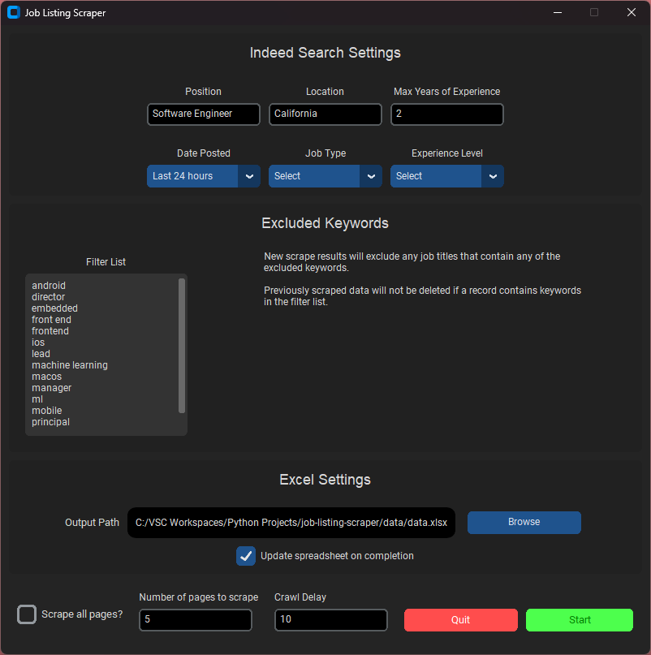

# Job Listing Scraper

This application scrapes Indeed job results and parses the data into a working CSV file that users can use for their job search.

## Usage

## Features

- User-friendly GUI via customTkinter
- Searching jobs using Position, Location, Date Posted, Job Type, and Experience Level fields
- Filtering job results via the years of experience mentioned in job descriptions
- Filtering job results via keywords in job titles
- Scraping all pages returned
- Scraping a specific number of pages
- Duplicate result handling (only unique results are appended to resulting CSV)
- Job tracking (Scraper will not overwrite the 'Applied' status of a job record in the CSV if it encounters the same job in a future scrape)

## Disclaimer

This project is intended for educational purposes only. The software is provided "as is" without warranty of any kind, express or implied. The developers of this project do not endorse or encourage any activities that may violate the robots.txt file, Terms of Service, or any other usage policies of websites being scraped.

Users of this software are responsible for ensuring that their use of the software complies with all applicable laws and website policies. The developers of this project will not be liable for any damages or legal consequences resulting from the use of this software.

Please use this software responsibly and ethically.
